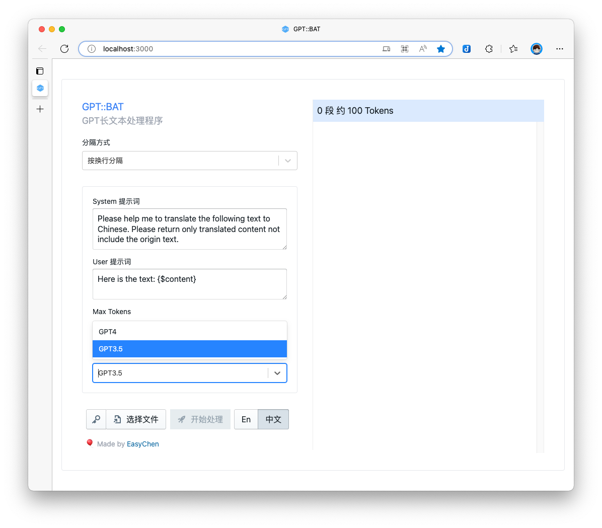
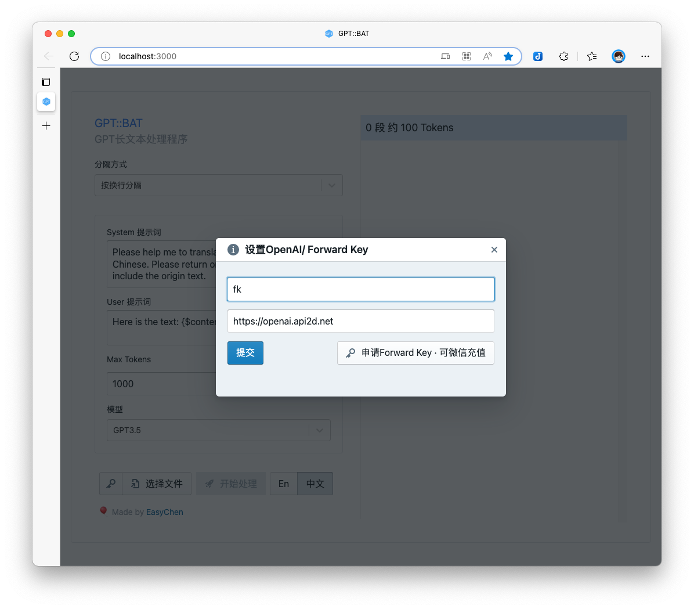
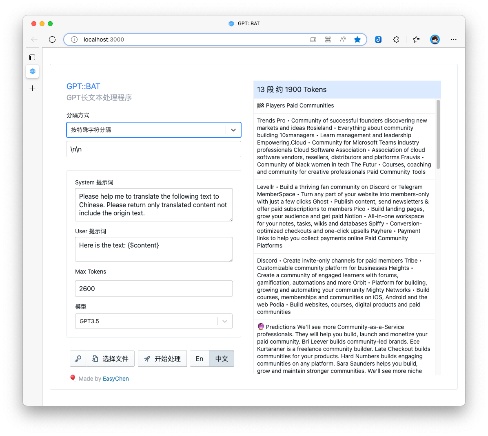
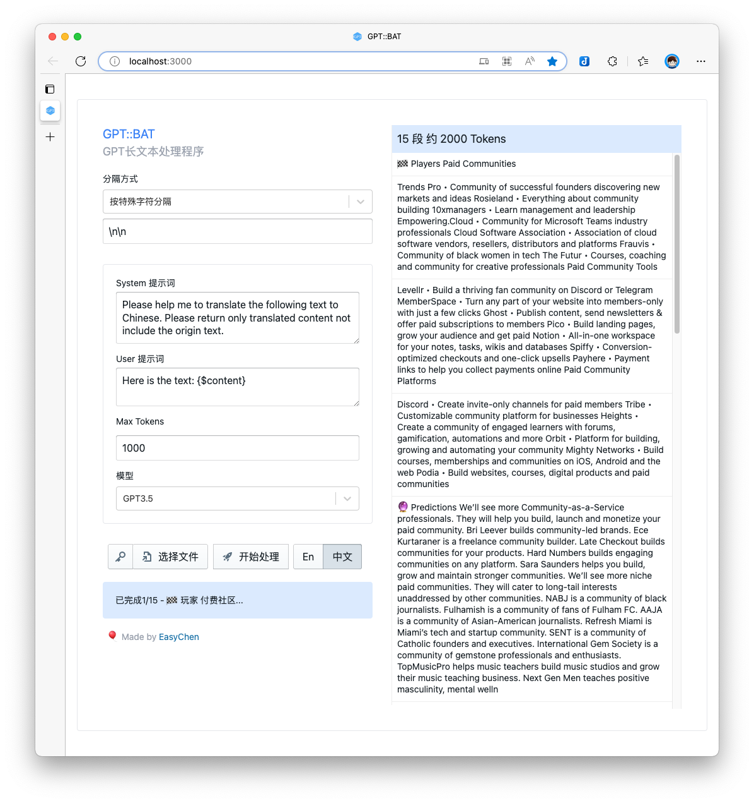

# GPT BAT

由于GPT尤其是3.5每次能处理的内容有限，如果有长内容要处理，聊天窗口就显得特别麻烦，因此我开发了 GPT BAT，它可以将长文分隔，提交给GPT，然后再将内容拼接下载。

## 使用说明 

1. 选择分隔方式，可以按行、按长度或者按特殊字符分隔。

2. 填入每次调用 GPT Chat 接口的设置，包括 System 提示词，User 提示词，Max Tokens，模型。

3. 点击左下角的 🔑 按钮，填写 OpenAI 或者 API2D 的 Key

4. 选择要处理的文件，可以在右侧预览分段和要消耗的 Token 数量，注意这个 Token 只是非常粗略的估算，一切以最终消费为准。

5. 点击「开始处理」，进行批量操作。如中途失败，可刷新重试，已处理部分会缓存到浏览器，自行跳过不会再次处理。完成后会自动下载文件，查看文件无误后，可以清除缓存。

